# Non Queue

Flutter client for **Non Queue** — order ahead, manage bonuses, browse partners, and handle account settings. The app targets **Android** and **iOS** with **GetX** for state and navigation, **Dio** for HTTP, and optional **mock repositories** for demos when the backend is offline.

## Screenshots

Captured UI flows from [`assets/screens/`](assets/screens/) (three per row, chronological by filename).

<table>
  <tr>
    <td align="center" width="33%">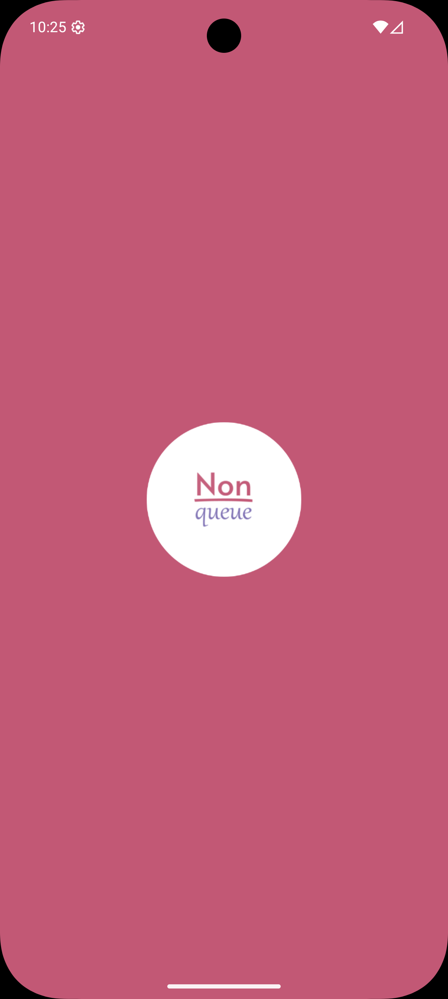<sub><code>222537</code></sub></td>
    <td align="center" width="33%">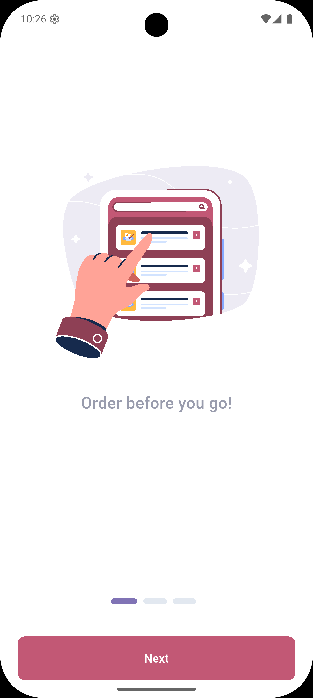<sub><code>222608</code></sub></td>
    <td align="center" width="33%">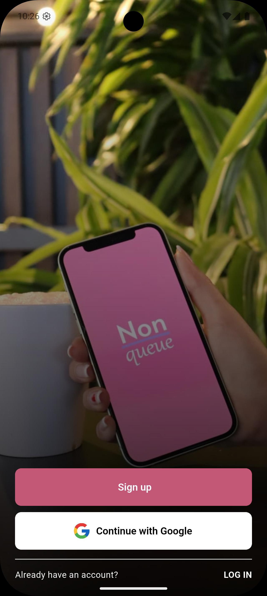<sub><code>222625</code></sub></td>
  </tr>
  <tr>
    <td align="center">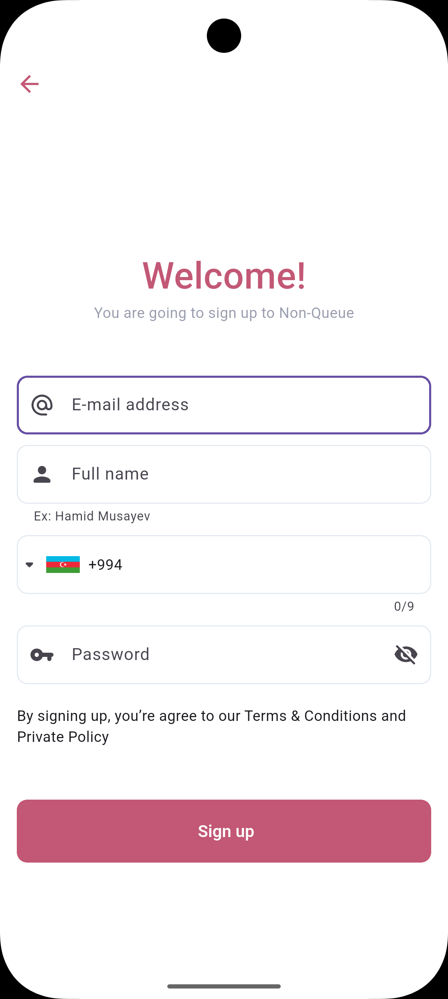<sub><code>222639</code></sub></td>
    <td align="center">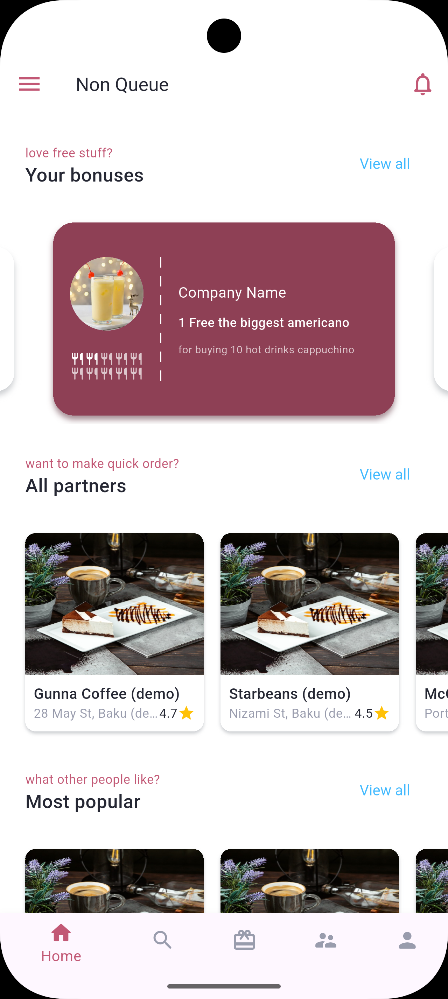<sub><code>222921</code></sub></td>
    <td align="center">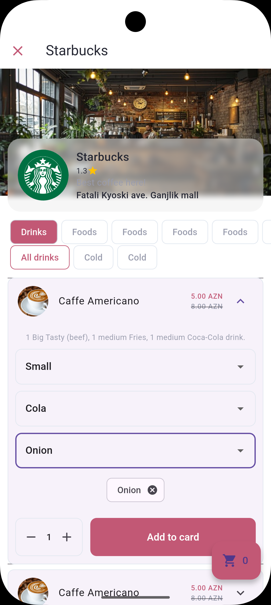<sub><code>223201</code></sub></td>
  </tr>
  <tr>
    <td align="center">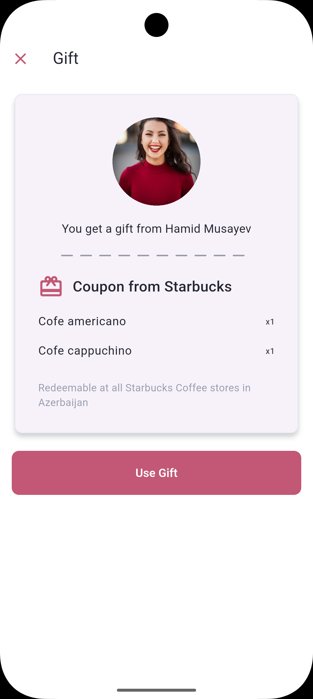<sub><code>223216</code></sub></td>
    <td align="center">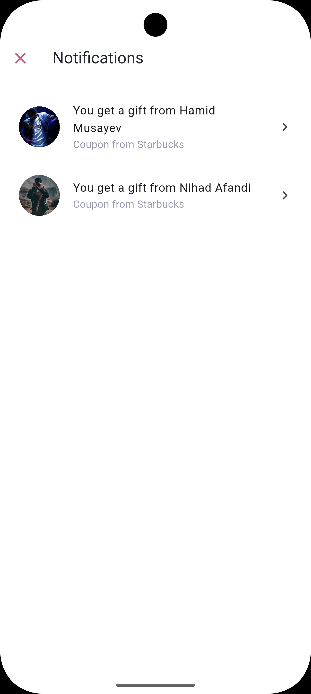<sub><code>223222</code></sub></td>
    <td align="center">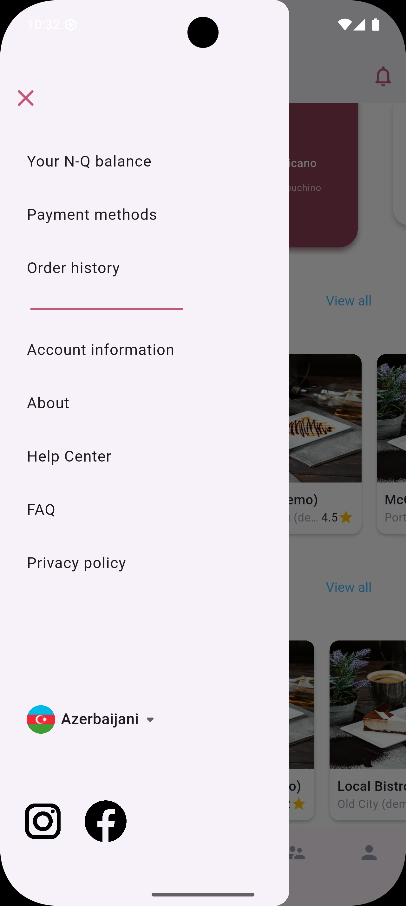<sub><code>223231</code></sub></td>
  </tr>
  <tr>
    <td align="center">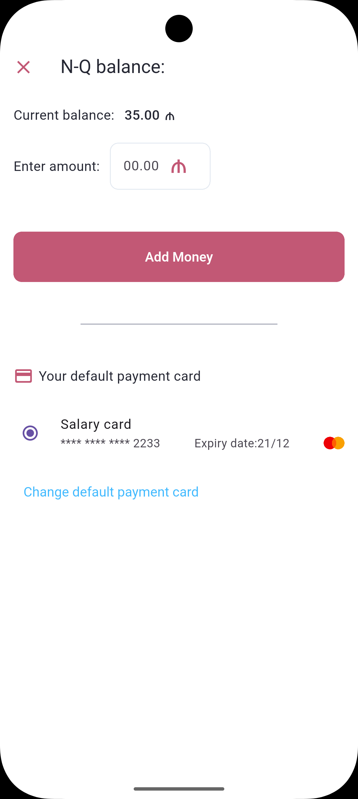<sub><code>223240</code></sub></td>
    <td align="center">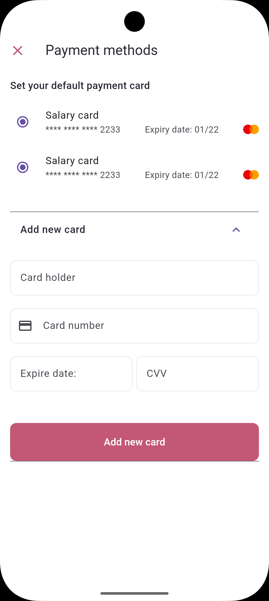<sub><code>223251</code></sub></td>
    <td align="center">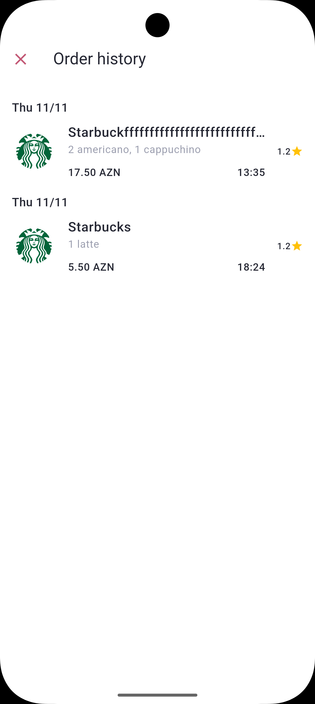<sub><code>223300</code></sub></td>
  </tr>
  <tr>
    <td align="center">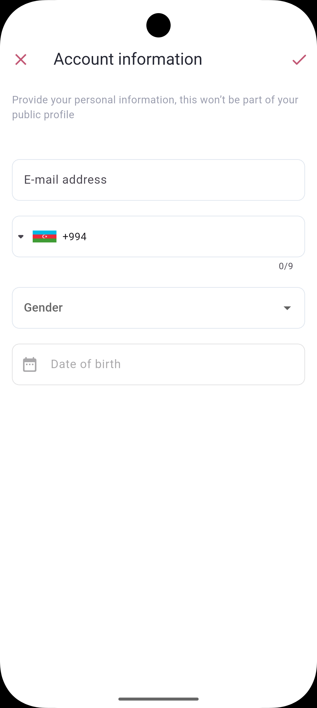<sub><code>223311</code></sub></td>
    <td align="center">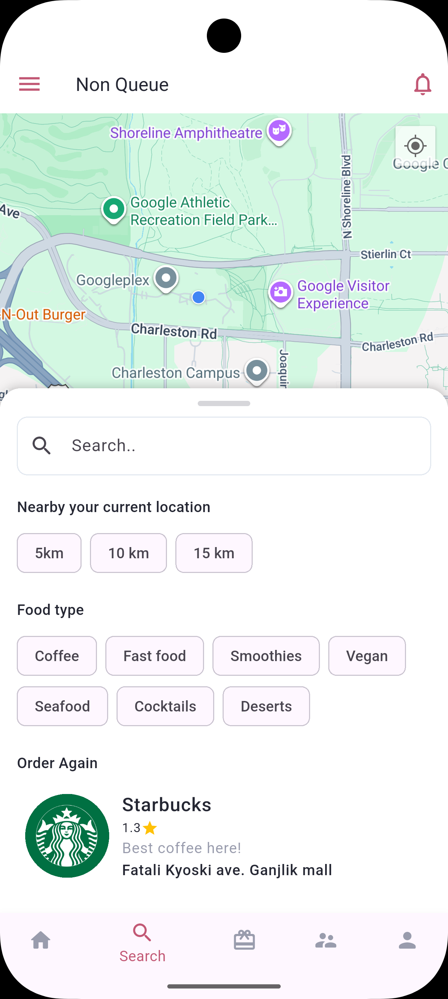<sub><code>223423</code></sub></td>
    <td align="center">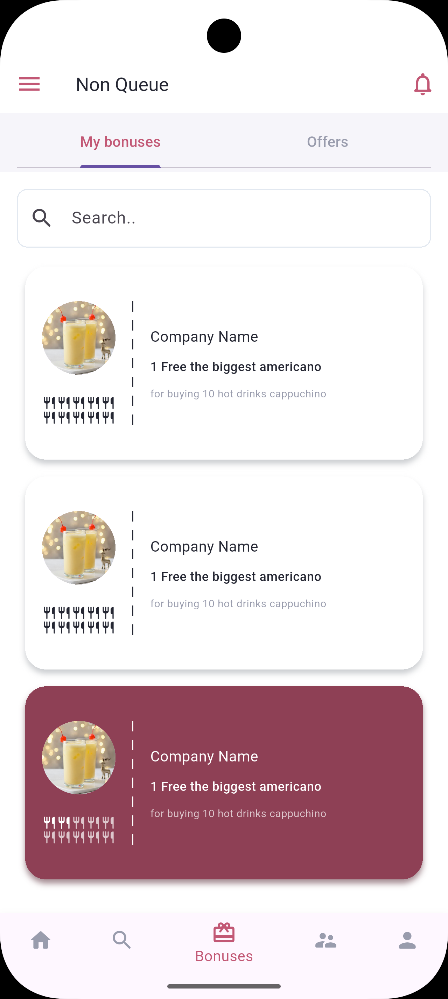<sub><code>223441</code></sub></td>
  </tr>
  <tr>
    <td align="center">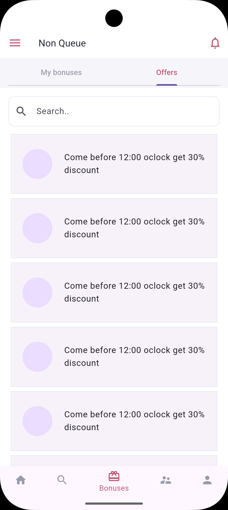<sub><code>223455</code></sub></td>
    <td align="center">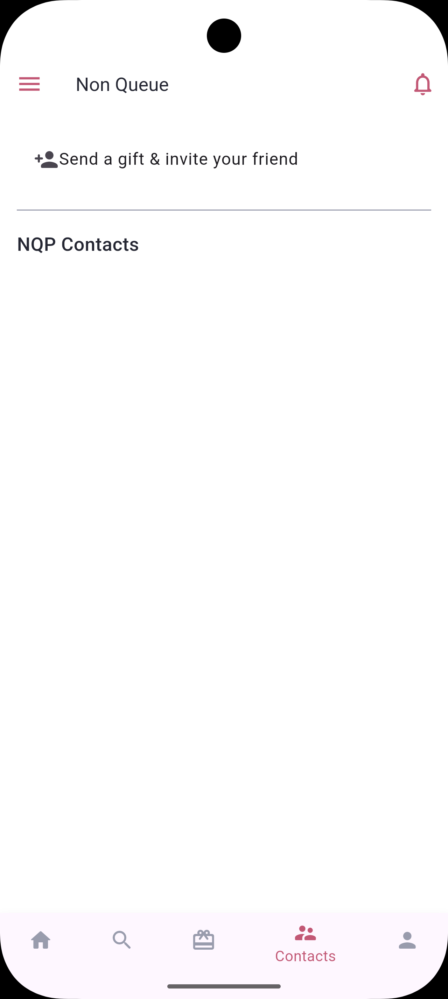<sub><code>223506</code></sub></td>
    <td align="center">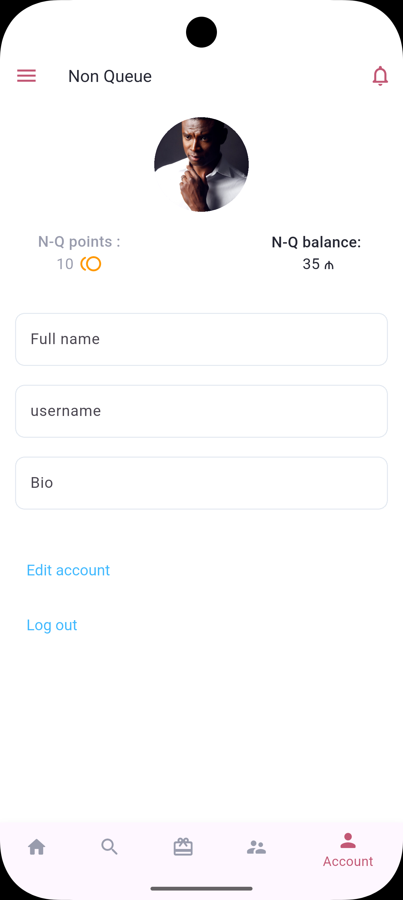<sub><code>223515</code></sub></td>
  </tr>
</table>

## Features

- Onboarding carousel, registration, email OTP, login, password reset  
- Main shell: home, map search, bonuses, contacts (device contacts + “on platform” matching), profile  
- Drawer: balance, payments, history, account, FAQ, help, about, privacy  
- Localized UI (**en**, **az**, **ru**) via GetX translations  
- Google Sign-In integration (when using live APIs)  
- **Mock API mode** for UI demos without servers  

## Tech stack

| Area | Choice |
|------|--------|
| Framework | Flutter 3.x, Dart **^3.8** |
| State / navigation | **GetX** (`GetMaterialApp`, `GetxController`, bindings, named routes) |
| Networking | **Dio 5** (single client, interceptors, `DioException` handling) |
| JSON models | **json_serializable** + `json_annotation` |
| Storage | **shared_preferences** via `SharedHelper` (token + user JSON) |
| Maps / location | **google_maps_flutter**, **location** |
| Other | carousel_slider, flutter_svg, qr_flutter, flutter_contacts, google_sign_in, sign_in_with_apple |

## Architecture (high level)

```text
UI (GetView)  →  Bindings (lazyPut controllers)  →  Controllers
                                                      ↓
                                        UserRepository / CompanyRepository
                                                      ↓
                              UserService + CompanyService + DioService  (live)
                              MockUserRepository + MockCompanyRepository (demo)
                                                      ↓
                                                 HTTP APIs
```

- **Repositories** (`lib/api/abstract/`) define contracts; **implementations** live under `lib/api/concrete/` or `lib/api/mock/`.  
- **Result types**: sealed `Success` / `Failure` in [`lib/api/result/result.dart`](lib/api/result/result.dart); shared envelope parsing in [`lib/api/api_response_parser.dart`](lib/api/api_response_parser.dart).  
- **Dependency injection**: [`lib/bindings/initial_binding.dart`](lib/bindings/initial_binding.dart) registers repositories. Screen-level bindings live in [`lib/bindings/`](lib/bindings/).  
- **Routes**: [`lib/routes/app_routes.dart`](lib/routes/app_routes.dart) + [`lib/routes/app_pages.dart`](lib/routes/app_pages.dart).  

## Project layout

```text
lib/
├── main.dart                 # GetMaterialApp, theme, initialRoute
├── core/
│   └── app_config.dart       # API bases, USE_MOCK_API flag
├── routes/                   # GetPage definitions
├── bindings/                 # InitialBinding, auth, in-app, drawer flows
├── api/
│   ├── abstract/             # ApiRepository, UserRepository, CompanyRepository
│   ├── concrete/             # DioService, UserService, CompanyService
│   ├── mock/                 # MockUserRepository, MockCompanyRepository
│   ├── result/
│   └── api_response_parser.dart
├── models/                   # user/*, company/* (+ *.g.dart)
├── screens/                  # feature folders: auth/, home/, inapp/, drawer/, …
├── utils/                    # constants, validators, translations, shared.dart, encryption.dart
└── widgets/                  # reusable UI (phone input, cards, routes, …)

android/                      # Gradle 8.14, AGP 8.11, Kotlin 2.2, Flutter Gradle plugin
assets/
├── splash/
├── flags/
└── screens/                  # README screenshots (see table above)
```

## Configuration

### Mock API (offline demo)

By default the app uses **mock** data (no network) so you can demo UI:

```bash
flutter run
```

`AppConfig.useMockApi` reads `USE_MOCK_API` (default **true**). To hit real backends:

```bash
flutter run --dart-define=USE_MOCK_API=false
```

Optional API host overrides:

```bash
flutter run --dart-define=USE_MOCK_API=false \
  --dart-define=USER_API_BASE=https://your-host:5000 \
  --dart-define=COMPANY_API_BASE=https://your-host:5002
```

See [`lib/core/app_config.dart`](lib/core/app_config.dart).

### Code generation (JSON)

After changing annotated models:

```bash
dart run build_runner build --delete-conflicting-outputs
```

## Run & build

```bash
flutter pub get
flutter run
```

```bash
flutter build apk --release
flutter build ios --release
```

### Android build notes

- **JDK 17+** recommended (aligned with Flutter’s Android toolchain).  
- Project uses **Gradle 8.14** and the **declarative Flutter Gradle plugin** (`settings.gradle` + `dev.flutter.flutter-gradle-plugin`).  
- If the project lives on a **different drive** than the Pub cache on Windows, `kotlin.incremental=false` is set in `android/gradle.properties` to avoid Kotlin incremental cache path issues.  

## Testing

```bash
flutter test
```

Smoke test pumps `MyApp` in [`test/widget_test.dart`](test/widget_test.dart).

## License / status

Internal or discontinued client — adjust this section for your distribution policy.
